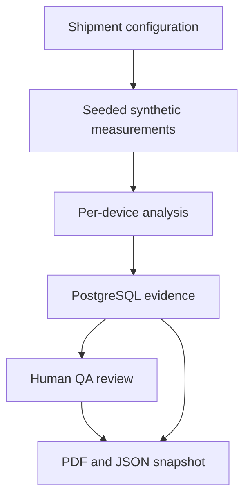

# Architecture

Next.js frontend và NestJS modular monolith dùng shared TypeScript contracts. Prisma quản lý PostgreSQL. Redis/BullMQ và MinIO tồn tại trong hạ tầng, nhưng workflow demo mới không phụ thuộc worker hoặc object storage.

Sinh số đo và tạo report hiện đồng bộ. QA review, simulation và lưu report dùng transaction. Số đo mô phỏng và ngữ cảnh Shipment luôn mang nhãn SYNTHETIC; review không sửa số đo gốc. Báo cáo giữ checksum, nguồn, generator/parser version, cấu hình, review và số đo của đúng lô.

Các package D5–D11 và parser benchmark tồn tại riêng. Chưa chuyển toàn bộ API legacy sang device-window và orchestration contract. Xem [phạm vi demo](demo-workflow.md).
