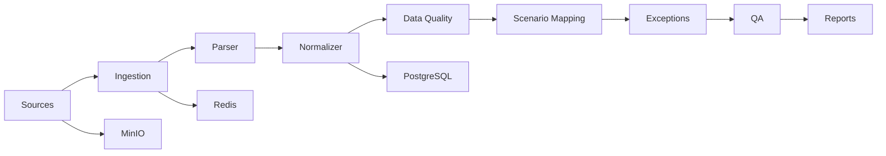

# Architecture

Next.js frontend và NestJS modular monolith dùng shared TypeScript contracts. Prisma quản lý PostgreSQL; Redis/BullMQ dành cho hàng đợi, MinIO dành cho raw file và report.

Đây là scaffold. Parser, worker, scenario builder, exception engine, QA và report chưa triển khai. Raw source phải bất biến, provenance phải được giữ lại. Ngữ cảnh scenario của benchmark là mô phỏng; spatial snapshot không được coi là time-series.
